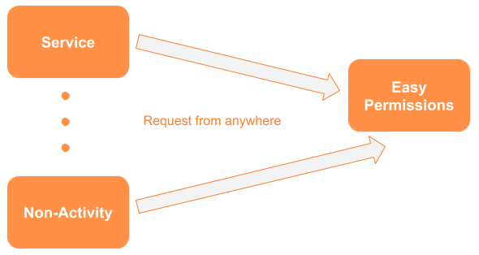

# Easy Permissions

Easy Permissions allows you to request all the permissions declared in your `AndroidManifest` with one line of code. It knows what permissions you have declared in your `AndroidManifest` and will request them for you if needed. In addition, it allows you to make this request from anywhere in your code; no longer will you have to request permissions exclusively from an `Activity`.

<p align="center">
  
</p>

---

**Sample** - It knows what permissions you have in your `AndroidManifest` and will request them if needed.
```kotlin
EasyPermissions.getInstance().requestPermissions(IPermissionsListener(
        onCompleted = { grantedPermissions, deniedPermissions ->

        }
))
```

---

# Table of Contents
1. [Information](#information)
2. [Setup](#setup)
3. [Example 1](#example-1)
   * [Kotlin](#kotlin)
   * [Java](#java)
4. [Example 2](#example-2)
5. [Example 3](#example-3)
6. [Demo App](#demo-app)
7. [License](#license)
8. [Contact](#contact)


## Information
Request permissions from anywhere. Make sure you implement `IPermissionsListener` to receive information about what is happening with your permission request.

## Setup
Include the below dependencies in your `build.gradle` project.

```gradle
buildscript {
    repositories {
        google()
        jcenter()
        maven { url "https://newtronlabs.jfrog.io/artifactory/libs-release-local"
            metadataSources {
                artifact()
            }
        }
    }
    dependencies {
        classpath 'com.android.tools.build:gradle:3.5.2'
        classpath 'com.newtronlabs.android:plugin:4.0.5'
    }
}

allprojects {
    repositories {
        google()
        jcenter()
        maven { url "https://newtronlabs.jfrog.io/artifactory/libs-release-local"
            metadataSources {
                artifact()
            }
        }
    }
}

subprojects {
    apply plugin: 'com.newtronlabs.android'
}
```

In the `build.gradle` for your app.

```gradle
dependencies {
    compileOnly 'com.newtronlabs.easypermissions:easypermissions:4.1.0-beta01'
}
```

## Example 1 
This example uses a `Service` to request the permission, something that cannot be done without EasyPermissions. It also automatically requests the permissions that you have enabled on your `AndroidManifest`.


### Kotlin
```kotlin
class ExampleService : Service(), IPermissionsListener {
    override fun onCreate() {
        super.onCreate()

        // Will request all permissions from the Manifest automatically.
        EasyPermissions.getInstance().requestPermissions(this)
    }

    override fun onCompleted(grantedPermissions: Set<String>, deniedPermissions: Set<String>) {}

    override fun onFailure(throwable: Throwable) {}
}
```

### Java
```java
public class ExampleService extends Service implements IPermissionsListener {
    @Override
    public void onCreate() {
        super.onCreate();
        
        // Will request all permissions from the Manifest automatically.
        EasyPermissions.getInstance().requestPermissions(this);
    }

    @Override
    public void onCompleted(Set<String> grantedPermissions, Set<String> deniedPermissions) {}

    @Override
    public void onFailure(Throwable throwable) {}
}
```

## Example 2
This example allows more flexibility so that you can decide which permissions you desire. Request as many permissions as you like. You may seperate them by commas or pass an array. Make sure that these permissions are declared in your `AndroidManifest` as well.

```kotlin
EasyPermissions.getInstance().requestPermissions(this,
       Manifest.permission.ACCESS_FINE_LOCATION,
       Manifest.permission.CAMERA,
       Manifest.permission.CALL_PHONE,
       Manifest.permission.WRITE_EXTERNAL_STORAGE);
```

## Example 3
Get a set of granted permissions.

```kotlin
EasyPermissions.getInstance().getGrantedPermissions()
```

### Always add the permission to your AndroidManifest.xml

As an Android requirement permissions must be included in the Manifest.

```xml
<uses-permission android:name="android.permission.ACCESS_FINE_LOCATION"/>
<uses-permission android:name="android.permission.CAMERA"/>
<uses-permission android:name="android.permission.CALL_PHONE"/>
<uses-permission android:name="android.permission.WRITE_EXTERNAL_STORAGE"/>
 ```

## Demo App
More detailed exmaples can be found in this repo's samples folders: [Demo app](/Sample)

---

## Support us
Please support the development of these libraries. We host and develop these libraries for free. Any support is welcomed. Thank you!

<p align="center">
  
</p>
**BTC Address**
39JmAfnNhaEPKz5wjQjQQj4jcv9BM11NQb

---

## License
https://gist.github.com/NewtronLabs/216f45db2339e0bc638e7c14a6af9cc8

## Contact
solutions@newtronlabs.com

### Website
http://www.newtronlabs.com/
