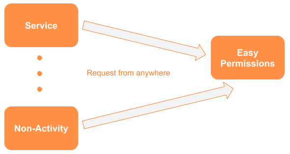

# Easy Permissions

Easy Permissions allows you to request all the permissions declared in your `AndroidManifest` with one line of code. It knows what permissions you have in your `AndroidManifest` and will request them for you. In addition, it allows you to make this request from anywhere in your code; no longer will you have to request permissions exclusively from an `Activity`.

<p align="center">
  
</p>

----

## Sample

Will request all permissions from the `AndroidManifest` automatically.
```java
EasyPermissions.getInstance().requestPermissions(this, this);
```

# Table of Contents
1. [Information](#information)
2. [Setup](#setup)
3. [Example 1](#example-1)
4. [Example 2](#example-2-java)
5. [Additional Example](#additional-example)
6. [License](#license)
7. [Contact](#contact)


## Information
As long as you have `Context` you can request a permission from anywhere. Make sure you implement `IPermissionsListener` to receive information about what is happening with your permission request.

## Setup

Include the below dependencies in your `build.gradle` project.

```gradle
buildscript {
    repositories {
        jcenter()
        maven { url "http://code.newtronlabs.com:8081/artifactory/libs-release-local" }
    }
    dependencies {
        classpath 'com.android.tools.build:gradle:3.1.4'
        classpath 'com.newtronlabs.android:plugin:2.0.1'
    }
}

allprojects {
    repositories {
        jcenter()
        maven { url "http://code.newtronlabs.com:8081/artifactory/libs-release-local" }
    }
}

subprojects {
    apply plugin: 'com.newtronlabs.android'
}
```

In the `build.gradle` for your app.

```gradle
dependencies {
    compileOnly 'com.newtronlabs.easypermissions:easypermissions:2.4.1'
}
```

## Example 1 
This example uses a `Service` to request the permission, something that cannot be done without EasyPermissions. It also automatically requests the permissions that you have enabled on your `AndroidManifest`.


### Kotlin


### Java

```java
public class ExampleService extends Service implements IPermissionsListener
{
    @Override
    public void onCreate()
    {
        super.onCreate();
        
        // Will request all permissions from the Manifest automatically.
        EasyPermissions.getInstance().requestPermissions(this, this);
    }

    @Override
    public void onCompleted(Set<String> grantedPermissions, Set<String> deniedPermissions)
    {
    }

    @Override
    public void onFailure(IError error)
    {
    }
}
```


## Example 2
This example allows more flexibility so that you can decide which permissions you desire.

```java
public class ExampleService extends Service implements IPermissionsListener
{
    @Override
    public void onCreate()
    {
        super.onCreate();

        // Request as many permissions as you like. You may seperate them by commas or pass an array.
        // Make sure that these permissions are in your Manifest as well.
        EasyPermissions.getInstance().requestPermissions(this, this,
                Manifest.permission.ACCESS_FINE_LOCATION,
                Manifest.permission.CAMERA,
                Manifest.permission.CALL_PHONE,
                Manifest.permission.WRITE_EXTERNAL_STORAGE);
    }

    @Override
    public void onCompleted(Set<String> grantedPermissions, Set<String> deniedPermissions)
    {
    }

    @Override
    public void onFailure()
    {
    }
}
```


### Always add the permission to your AndroidManifest.xml

As an Android requirement permissions must be included in the Manifest.

```xml
<uses-permission android:name="android.permission.ACCESS_FINE_LOCATION"/>
<uses-permission android:name="android.permission.CAMERA"/>
<uses-permission android:name="android.permission.CALL_PHONE"/>
<uses-permission android:name="android.permission.WRITE_EXTERNAL_STORAGE"/>
 ```

## Additional Example
More detailed exmaples can be found in this repo's samples folders: [Demo app](/Sample)

---
## License

Easy Permissions binaries and source code can only be used in accordance with Freeware license. That is, freeware may be used without payment, but may not be modified. The developer of Easy Permissions retains all rights to change, alter, adapt, and/or distribute the software. Easy Permissions is not liable for any damages and/or losses incurred during the use of Easy Permissions.

You may not decompile, reverse engineer, pull apart, or otherwise attempt to dissect the source code, algorithm, technique or other information from the binary code of Easy Permissions unless it is authorized by existing applicable law and only to the extent authorized by such law. In the event that such a law applies, user may only attempt the foregoing if: (1) user has contacted Newtron Labs to request such information and Newtron Labs has failed to respond in a reasonable time, or (2) reverse engineering is strictly necessary to obtain such information and Newtron Labs has failed to reply. Any information obtained by user from Newtron Labs may be used only in accordance to the terms agreed upon by Newtron Labs and in adherence to Newtron Labs confidentiality policy. Such information supplied by Newtron Labs and received by user shall not be disclosed to a third party or used to create a software substantially similar to the technique or expression of the Newtron Labs Easy Permissions software.

You are solely responsible for determining the appropriateness of using Easy Permissions and assume any risks associated with Your use of Easy Permissions. In no event and under no legal theory, whether in tort (including negligence), contract, or otherwise, unless required by applicable law (such as deliberate and grossly negligent acts) or agreed to in writing, shall Newtron Labs be liable to You for damages, including any direct, indirect, special, incidental, or consequential damages of any character arising as a result of this License or out of the use or inability to use the Easy Permissions (including but not limited to damages for loss of goodwill, work stoppage, computer failure or malfunction, or any and all other commercial damages or losses), even if Newtron Labs has been advised of the possibility of such damages. 

## Contact

solutions@newtronlabs.com
